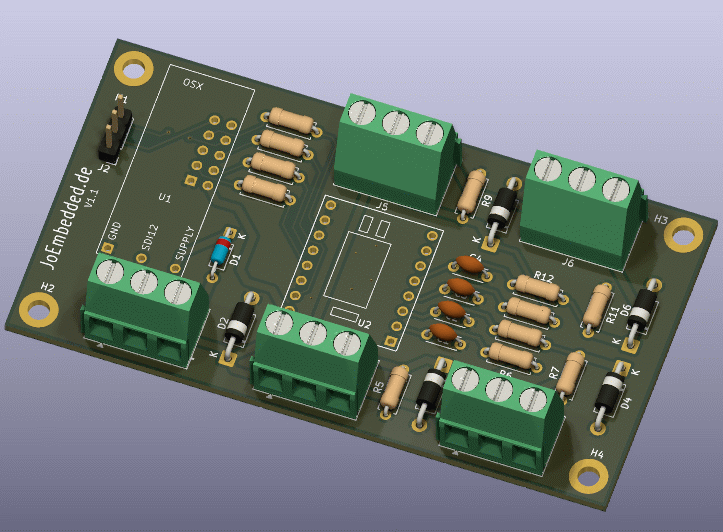

# OSX Typ350 ADS1220 Universal-ADC Sensor - Benutzerhandbuch

- **Device-Typ:** Typ350  
- **Chip:** Texas Instruments ADS1220 (24-Bit Sigma-Delta ADC)  
- **Schnittstelle:** SDI-12 V1.3
- **Stand:** V0.1/28.02.2026/JoEm
- **Info:** Docu wurde mit [AutoDoc](https://github.com/joembedded/autodoc) erzeugt
---



*PCB V1.1 für 0/4-20 mA (weitere Versionen: PT100, Brücke, ...)*

## 1. Überblick

Der T350 ("OSX Typ350") ist ein hochpräziser, universeller analoger Datenerfassungsknoten auf Basis des ADS1220. Er unterstützt bis zu **8 physikalische Messkanäle** (Betriebsarten), die über das Array `ad_physkan[]` im Firmware-Source fest konfiguriert sind.

**Typische Anwendungen:**
- Hochpräzise PT100-Temperaturmessung (–70 … +120 °C, Genauigkeit < 0,05 °C)
- 0/4–20-mA-Strommessung
- Brückensensoren (Last-/Druckzellen)
- (Solar-)Strahlungssensoren
- Allgemeine differential- und single-ended Spannungsmessung

### Hardwareanschluss (SPI-Signale)

| Signal      | Pin    | Farbe (Kabel) | Richtung am AD |
|-------------|--------|---------------|----------------|
| SCLK        | IX_SCL | gelb          | IN             |
| DIN (MOSI)  | IX_SDA | grün          | IN             |
| DO / #DRDY  | IX_X0  | weiß          | OUT            |
| #DRDY       | IX_X1  | blau          | OUT            |
| #Vcc (Pwr)  | IX_X2  | –             | LOW = EIN      |

> [!NOTE]
> Der ADS1220 wird mit dauerhaft LOW gezogenem #CS betrieben (**SPI-Mode 1**, CPOL=0, CPHA=1). Nach PowerOff zieht IX_X2 die SPI-Leitungen via 2 × 15 kΩ auf GND.

---

## 2. Physikalische Kanäle (`ad_physkan[]`)

Die Firmware kennt **8 physikalische Kanäle** (Indices 0–7). Jeder Kanal hat eine fest konfigurierte Betriebsart (`typ`), ADS1220-Registerkonfiguration, Mittelwertbildung und Einheit.

### 2.1 Betriebsarten (`typ`)

| `typ` | Konstante         | Beschreibung |
|-------|-------------------|--------------|
| 1     | `P_TYP_ITEMP`     | Interne Chiptemperatur des ADS1220 |
| 2     | `P_TYP_PT100_A`   | PT100 via 2 kΩ Referenz + IDAC 1 mA + Polynom-Linearisierung |
| 3     | `P_TYP_STD`       | Standard-AD (single-ended oder differential), Ergebnis in mV oder Counts |

### 2.2 Kanalübersicht

| Idx | SDI-12-Cmd | Typ | Konfiguration           | SPS  | Mittelwert | Kalibrierung | Einheit   | Messzeit  |
|-----|------------|-----|-------------------------|------|------------|--------------|-----------|-----------|
| 0   | M2         | 1   | Interne Temperatur      | 45   | 1×         | nein         | `oC_int`  | ~22 ms    |
| 1   | M3         | 2   | PT100 (ext. Ref, IDAC)  | 45   | 8×         | ja           | `oC_PT100`| ~453 ms   |
| 2   | M4         | 3   | Single-Ended AIN0       | 45   | 4×         | ja           | `mV_S0`   | ~275 ms   |
| 3   | M5         | 3   | Single-Ended AIN1       | 45   | 4×         | ja           | `mV_S1`   | ~275 ms   |
| 4   | M6         | 3   | Single-Ended AIN2       | 45   | 4×         | ja           | `mV_S2`   | ~275 ms   |
| 5   | M7         | 3   | Single-Ended AIN3       | 45   | 4×         | ja           | `mV_S2`   | ~275 ms   |
| 6   | M8         | 3   | Differentiell AIN0–AIN1 | 45   | 8×         | ja           | `mV_D01`  | ~453 ms   |
| 7   | M9         | 3   | Differentiell AIN2–AIN3 | 45   | 8×         | ja           | `mV_D23`  | ~453 ms   |

**Kalibrierung (Kali-Flag):** Wenn aktiv, wird vor der eigentlichen Messung automatisch ein Offset-Nullpunkt durch internes Kurzschließen der Eingänge (AIN_p/n auf AVDD/2) ermittelt und subtrahiert. Dies verdoppelt näherungsweise die Messzeit.

### 2.3 Technische Details der Betriebsarten

#### Typ 1 – Interne Temperatur (`oC_int`)
- Nutzt den internen Temperatursensor des ADS1220
- Auflösung: Rohwert / 32768 = °C
- Konfiguration: `ITEMP_CONFIG = 0x5022E0`
  - `TS_ENA` (interner Temperatursensor aktiv), Single-Shot, externe Referenz (irrelevant), FIR 50/60 Hz
- Messzeit: ca. 22 ms (1 Sample, kein Kali)

#### Typ 2 – PT100 (`oC_PT100`)
- 2-Leiter-PT100 mit 2 kΩ Referenzwiderstand und 1-mA-IDAC
- Polynom-Linearisierung 2. Grades (koeffizientenbasiert, ermittelt per Kalibrierung):

> [!NOTE]
> Hardware muss PT100 unterstützen 

$$T = c_0 + c_1 \cdot x + c_2 \cdot x^2$$

mit der Linearisierung:

$$c_0 = -2{,}457390 \times 10^{2}, \quad c_1 = 7{,}022650 \times 10^{-5}, \quad c_2 = 8{,}966090 \times 10^{-13}$$

- Gültigkeitsbereich: Rohwert 2 427 000 … 4 910 000 Counts (ca. –70 … +120 °C)
- Konfiguration: `PT100_CONFIG = 0x80562406`
  - AIN0/AIN1, GAIN=8, PGA AN, EXT-REF, IDAC1 → AIN3, 1 mA
- Messzeit: ca. 453 ms (8 Samples, Kali aktiv)

> [!CAUTION]
> Liegt der Rohwert außerhalb des Gültigkeitsbereichs, gibt der PT100-Kanal **–99 °C** zurück (Sensorbruch oder Bereich –70 … +120 °C überschritten).

#### Typ 3 – Standard-AD (`mV_…`)
- **Single-Ended (SE):** AIN0–AIN3 gegen AGND, GAIN=1, PGA deaktiviert
  - Umrechnungsfaktor: `SE_MULTI_G1 = 2.4414e-4` (2,4414 × 10⁻⁴) → Ergebnis in mV
  - Interne Referenz (ca. 2,048 V → Messbereich 0 … 2048 mV)
  - Konfiguration SE0: `SE_CONFIG = 0x102481`
- **Differentiell (DE):** AIN0–AIN1 bzw. AIN2–AIN3, GAIN=128, PGA aktiv
  - Umrechnungsfaktor: `DE_MULTI_G128 = 1.907e-6` (1,907 × 10⁻⁶) → Ergebnis in mV
  - Interne Referenz → Messbereich ± 16 mV (bei GAIN=128)
  - Konfiguration DE01: `DE_CONFIG = 0x10240E`

> [!NOTE]
> Hardware muss für 0/4–20-mA-Strommessung einen 100 Ohm Shuntwiderstand haben. Für Brückenmessung sollte die Brücke auf einen Pegel von ca. 1 V gelegt werden, z.B. durch einen hochohmigen Spannungsteiler.

---

## 3. SDI-12 Standard-Messbefehle

> [!NOTE]
> Die Messung erfolgt mit den regulären SDI-12-Befehlen `aM!`, `aM1!` … `aM9!` (und natürlich auch in Kombination mit CRC: `aMC!`, `aMC1!` … `aMC9!`).
> Hier werden allerdings nur die Kommandos `M` und später `X` und `I` dokumentiert, alle anderen Kommandos entsprechen dem Standard SDI-12 V1.3 (siehe SDI-12 Spezifikation).

### 3.1 Befehlsübersicht

| Befehl | Kanäle                  | Beschreibung                                                           |
|--------|-------------------------|------------------------------------------------------------------------|
| `aM!`  | Alle aktiven Kanäle     | Misst alle Kanäle, deren Bit im `m0_mask`-Register gesetzt ist        |
| `aM1!` | Alle aktiven + VSup     | Wie `M`, zusätzlich Versorgungsspannung (`VSup`) als letzter Kanal    |
| `aM2!` | Kanal 0 (intern Temp)   | Nur interne Chiptemperatur (oC_int)                                   |
| `aM3!` | Kanal 1 (PT100)         | Nur PT100-Temperatur (oC_PT100)                                       |
| `aM4!` | Kanal 2 (SE AIN0)       | Nur Single-Ended-Kanal AIN0 (mV_S0)                                  |
| `aM5!` | Kanal 3 (SE AIN1)       | Nur Single-Ended-Kanal AIN1 (mV_S1)                                  |
| `aM6!` | Kanal 4 (SE AIN2)       | Nur Single-Ended-Kanal AIN2 (mV_S2)                                  |
| `aM7!` | Kanal 5 (SE AIN3)       | Nur Single-Ended-Kanal AIN3 (mV_S2)                                  |
| `aM8!` | Kanal 6 (DE AIN0–AIN1)  | Nur Differentiell AIN0–AIN1 (mV_D01)                                 |
| `aM9!` | Kanal 7 (DE AIN2–AIN3)  | Nur Differentiell AIN2–AIN3 (mV_D23)                                 |

> `a` = SDI-12-Adresse des Sensors (Standard: `0`)

**Fehlerwerte im Messergebnis:**

| Wert     | Bedeutung                                 |
|----------|-------------------------------------------|
| `–99`    | PT100: Außerhalb Messbereich / Bruch      |
| `–9998`  | AD-Initialisierungsfehler                 |
| `–9999`  | Allgemeiner Messfehler                    |

---

## 4. SDI-12 Erweiterte Befehle (`X`-Kommandos)

Alle Konfigurationsbefehle beginnen mit `aX` gefolgt vom jeweiligen Befehlsbuchstaben. Zum **Lesen** wird kein `=`-Zeichen verwendet, zum **Schreiben** mit `=Wert`. Jeder Befehl wird mit `!` abgeschlossen.

> [!WARNING]
> Alle Parameteränderungen sind **flüchtig** (RAM). Erst `aXWrite!` speichert sie dauerhaft im Flash (NVM).

---

### 4.1 Koeffizienten (`K`) – Individuelle Skalierung pro Kanal

Jeder physikalische Kanal hat **2 Koeffizienten**: `Multi` (Index gerade) und `Offset` (Index ungerade).

Anwendungsreihenfolge:
```
Ergebnis = (AD-Rohwert × Kanal-Multi) × Kn_Multi − Kn_Offset
```

**Koeffizienten-Tabelle:**

| Nr.   | Name                        | Default |
|-------|-----------------------------|---------|
| K0    | Temp_int.Multi              | 1,0     |
| K1    | Temp_int.Offset             | 0,0     |
| K2    | Temp_PT100.Multi            | 1,0     |
| K3    | Temp_PT100.Offset           | 0,0     |
| K4    | SEnd_0.Multi                | 1,0     |
| K5    | SEnd_0.Offset               | 0,0     |
| K6    | SEnd_1.Multi                | 1,0     |
| K7    | SEnd_1.Offset               | 0,0     |
| K8    | SEnd_2.Multi                | 1,0     |
| K9    | SEnd_2.Offset               | 0,0     |
| K10   | SEnd_3.Multi                | 1,0     |
| K11   | SEnd_3.Offset               | 0,0     |
| K12   | Diff_01.Multi               | 1,0     |
| K13   | Diff_01.Offset              | 0,0     |
| K14   | Diff_23.Multi               | 1,0     |
| K15   | Diff_23.Offset              | 0,0     |

**Syntax:**

| Befehl              | Funktion                     | Beispiel               |
|---------------------|------------------------------|------------------------|
| `aXKn!`             | Koeffizient n lesen          | `0XK2!`                |
| `aXKn=Wert!`        | Koeffizient n setzen         | `0XK3=0.5!`            |

**Antwort:** `aKn=Wert` (z. B. `0K3=0.500000`)

---

### 4.2 Kanalmaske (`B`) – Aktive Kanäle bei M / M1

Die Bitmaske `m0_mask` (1 Byte) steuert, welche Kanäle bei `M` und `M1` gemessen werden.  
Bit 0 → Kanal 0 (iTemp), Bit 1 → Kanal 1 (PT100), … , Bit 7 → Kanal 7 (DE23).

**Default-Wert: `m0_mask = 60`** = `0b00111100` → Kanäle 2, 3, 4, 5 aktiv (SE AIN0–AIN3)

$$60 = 4 + 8 + 16 + 32 = \text{Bit 2} + \text{Bit 3} + \text{Bit 4} + \text{Bit 5}$$

| Befehl              | Funktion                     | Beispiel               |
|---------------------|------------------------------|------------------------|
| `aXB!`              | Aktuelle Maske lesen         | `0XB!`                 |
| `aXB=Wert!`         | Maske setzen (1–255, dezimal)| `0XB=60!` (nur SE AIN0–AIN3) |

**Antwort:** `aB=Wert` (z. B. `0B=60`)

**Bit-Zuordnung der Kanäle:**

| Bit | Bitwert | Kanal | Beschreibung        | Aktiv bei m0_mask=60? |
|-----|---------|-------|---------------------|-----------------------|
| 0   | 1       | 0     | Interne Temperatur  | nein                  |
| 1   | 2       | 1     | PT100               | nein                  |
| 2   | 4       | 2     | SE AIN0 (mV_S0)     | **ja**                |
| 3   | 8       | 3     | SE AIN1 (mV_S1)     | **ja**                |
| 4   | 16      | 4     | SE AIN2 (mV_S2)     | **ja**                |
| 5   | 32      | 5     | SE AIN3 (mV_S2)     | **ja**                |
| 6   | 64      | 6     | Diff AIN0–AIN1      | nein                  |
| 7   | 128     | 7     | Diff AIN2–AIN3      | nein                  |

**Beispiel: Alle SE-Kanäle + PT100 aktivieren**

```
0XB=62!        62 = 2+4+8+16+32 (PT100 + SE AIN0…AIN3)
0XWrite!
```

> Kanal-Aktivstatus und vollständige `k`-Ausgabe → Abschnitt 5.1.

---

### 4.3 Individuelle Einheit (`U`) – Kanalbezeichnung überschreiben

Jeder Kanal hat eine Standard-Einheit aus `ad_physkan[]` (z. B. `oC_PT100`). Diese kann pro Kanal überschrieben werden (max. 8 Zeichen). Bei leerem String wird die Standard-Einheit verwendet.

| Befehl              | Funktion                              | Beispiel               |
|---------------------|---------------------------------------|------------------------|
| `aXUn!`             | Einheit von Kanal n lesen             | `0XU1!`                |
| `aXUn=Text!`        | Einheit von Kanal n setzen            | `0XU1=degC!`           |
| `aXUn=!`            | Einheit von Kanal n zurücksetzen      | `0XU1=!`               |

**Antwort:** `aUn='Text'` (z. B. `0U1='degC'`)

---

### 4.4 Ausgabegenauigkeit (`P`) – Nachkommastellen

Legt die Anzahl der Nachkommastellen für die SDI-12-Ausgabe fest (0–9).  
Sonderwert 7, 8, 9: Standardformat `%+f` (printf-default).

**Formatcodes:**

| P-Wert | Format   | Beispiel-Ausgabe |
|--------|----------|-----------------|
| 0      | `%+.0f`  | `+23`           |
| 1      | `%+.1f`  | `+23.4`         |
| 2      | `%+.2f`  | `+23.45`        |
| 3      | `%+.3f`  | `+23.450`       |
| 4–6    | …        | …               |
| 7–9    | `%+f`    | printf-default  |

| Befehl              | Funktion                              | Beispiel               |
|---------------------|---------------------------------------|------------------------|
| `aXPn!`             | Präzision von Kanal n lesen           | `0XP1!`                |
| `aXPn=Wert!`        | Präzision von Kanal n setzen (0–9)    | `0XP1=3!`              |

**Antwort:** `aPn=Wert` (z. B. `0P1=3`)

---

### 4.5 Parameter speichern / Sensor identifizieren

| Befehl           | Funktion                                                              |
|------------------|-----------------------------------------------------------------------|
| `aXWrite!`       | Alle Parameter (SDI-Adresse, Koeffizienten, Maske, Einheiten, Präzision) dauerhaft im Flash speichern |
| `aXSensor!`      | Sensortyp abfragen → Antwort: `aADS1220!`                            |

> [!IMPORTANT]
> `aXWrite!` muss nach **jeder** Konfigurationsänderung explizit aufgerufen werden – andernfalls gehen alle Änderungen beim nächsten Neustart verloren.

---

## 5. Kommandozeilen-Befehle (TB-UART / Debug-Terminal)

Diese Befehle sind über die serielle Debugschnittstelle (tb_tools UART) verfügbar.

### 5.1 Gerätebefehle (`device_type_cmdline`)

| Befehl | Funktion |
|--------|----------|
| `k`    | Alle Koeffizienten (K0–K15) mit Namen, aktuellem Wert, Einheit, Präzision und Aktivstatus (ON/Bitnummer) ausgeben |
| `p`    | (Reserviert, ohne Funktion) |

**Beispielausgabe `k` (bei `m0_mask = 60` – nur SE AIN0…AIN3 aktiv):**
```
>k
K0: 1.000000 Temp_int.Multi(f) (Def: 1.0) Unit:'oC_int' Prec:2 OFF(1)
K1: 0.000000 Temp_int.Offset(f) (Def: 0.0)
K2: 1.000000 Temp_PT100.Multi(f) (Def: 1.0) Unit:'oC_PT100' Prec:3 OFF(2)
K3: 0.000000 Temp_PT100.Offset(f) (Def: 0.0)
K4: 1.000000 SEnd_0.Multi(f) (Def: 1.0) Unit:'mV_S0' Prec:9 ON(4)*
K5: 0.000000 SEnd_0.Offset(f) (Def: 0.0)
K6: 1.000000 SEnd_1.Multi(f) (Def: 1.0) Unit:'mV_S1' Prec:9 ON(8)*
K7: 0.000000 SEnd_1.Offset(f) (Def: 0.0)
K8: 1.000000 SEnd_2.Multi(f) (Def: 1.0) Unit:'mV_S2' Prec:9 ON(16)*
K9: 0.000000 SEnd_2.Offset(f) (Def: 0.0)
K10: 1.000000 SEnd_3.Multi(f) (Def: 1.0) Unit:'mV_S2' Prec:9 ON(32)*
K11: 0.000000 SEnd_3.Offset(f) (Def: 0.0)
K12: 1.000000 Diff_01.Multi(f) (Def: 1.0) Unit:'mV_D01' Prec:9 OFF(64)
K13: 0.000000 Diff_01.Offset(f) (Def: 0.0)
K14: 1.000000 Diff_23.Multi(f) (Def: 1.0) Unit:'mV_D23' Prec:9 OFF(128)
K15: 0.000000 Diff_23.Offset(f) (Def: 0.0)
Bitmask Channels: 60
```

Die Spalte am Zeilenende zeigt:
- `ON(Bitwert)*` – Kanal ist aktiv (Bit in `m0_mask` gesetzt)
- `OFF(Bitwert)` – Kanal ist inaktiv (Bit nicht gesetzt)
- Nur Multi-Koeffizienten (gerader Index) zeigen den Status; Offset-Koeffizienten (ungerader Index) bleiben ohne Status-Suffix.

### 5.2 Debug-Befehle (nur wenn `#define DEBUG` aktiv)

> [!TIP]
> Debug-Befehle sind nur verfügbar, wenn `#define DEBUG` in der Firmware aktiv ist.

| Befehl    | Funktion |
|-----------|----------|
| `a<n>`    | Kanal n (0–7) in Dauerschleife messen und Rohwert,  Laufzeit und physikalisches Ergebnis ausgeben. Beenden mit beliebiger Taste. |

**Beispielausgabe `a1` (PT100):**
```
Val:1
AD-Reset: 0
Res:3456789 (P:470/Real:463 msec) => +21.456 oC_PT100
Res:3456901 (P:470/Real:461 msec) => +21.458 oC_PT100
...
AD-Deepsleep
```

---

## 6. Parameterspeicherung (NVM)

Alle veränderbaren Betriebsparameter werden im internen Flash des Prozessors gespeichert:

| Parameter      | Inhalt                                      |
|----------------|---------------------------------------------|
| `param.koeff[]`        | 16 Float-Koeffizienten (K0–K15)    |
| `param.m0_mask`        | Kanalmaske für M / M1              |
| `param.precision[]`    | Ausgabepräzision pro Kanal (0–9)   |
| `param.ind_unit[]`     | Individuelle Einheiten pro Kanal   |
| `param.ble_advname`    | BLE-Advertising-Name               |
| SDI-12-Adresse         | Gespeichert unter `ID_INTMEM_SDIADR` |

> Speichern erfolgt ausschließlich durch `aXWrite!` (→ Abschnitt 4.5).

---

## 7. Gerätekennzeichnung

Die Sensor-ID hat folgendes Format:
```
TT_A24_A_0350_OSX<MAC_Low_HEX>
```
Beispiel: `TT_A24_A_0350_OSX1A2B3C4D`

- `TT` = TT (interne Kennung)
- `A24` = Analog Sensor 24 Bit
- `A` = Software-Kennung
- `0350` = Device-Typ
- `OSX` = OSX-Master-Plattform
- `<MAC>` = Untere 32 Bit der BLE-MAC-Adresse (entspricht Standard BLE-Advertising-Name)

---

## 8. Standardkonfiguration ab Werk

| Parameter       | Standardwert      |
|-----------------|-------------------|
| SDI-12-Adresse  | `0`               |
| m0_mask         | `60` (Kanäle 2–5 aktiv: SE AIN0…AIN3) |
| Präzision       | K0:2, K1:3, K2–K7:9 (printf-default) |
| Alle Koeffizienten | Multi=1,0, Offset=0,0 |
| Individuelle Einheiten | leer (Kanalstandard) |

---

## 9. Schnellreferenz SDI-12-Befehle

```
aM!           Alle aktiven Kanäle messen
aM1!          Alle aktiven Kanäle + Versorgungsspannung
aM2! – aM9!   Einzelkanal 0–7 messen
aXKn!         Koeffizient n lesen
aXKn=val!     Koeffizient n setzen
aXB!          Kanalmaske lesen
aXB=val!      Kanalmaske setzen  (z. B. 60 = nur SE AIN0…AIN3)
aXUn!         Einheit Kanal n lesen
aXUn=str!     Einheit Kanal n setzen
aXPn!         Präzision Kanal n lesen
aXPn=val!     Präzision Kanal n setzen (0–9)
aXWrite!      Parameter in Flash speichern
aXSensor!     Sensortyp abfragen
```
